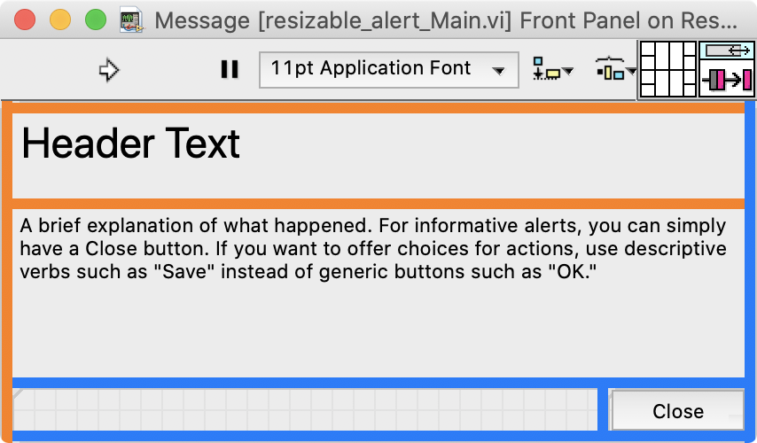
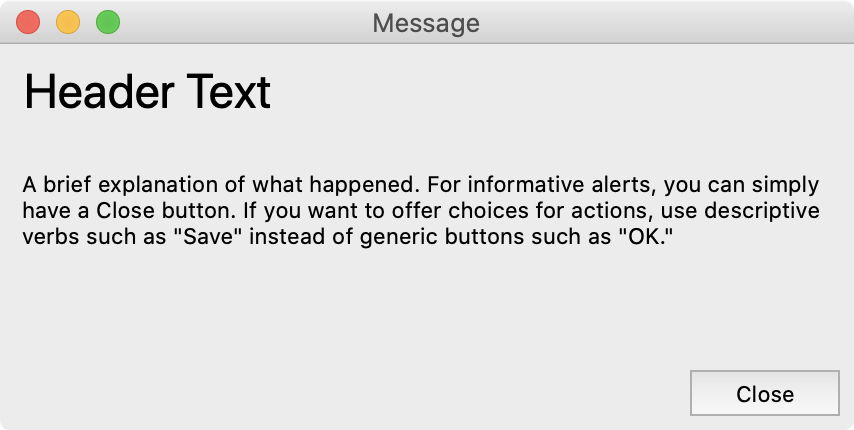
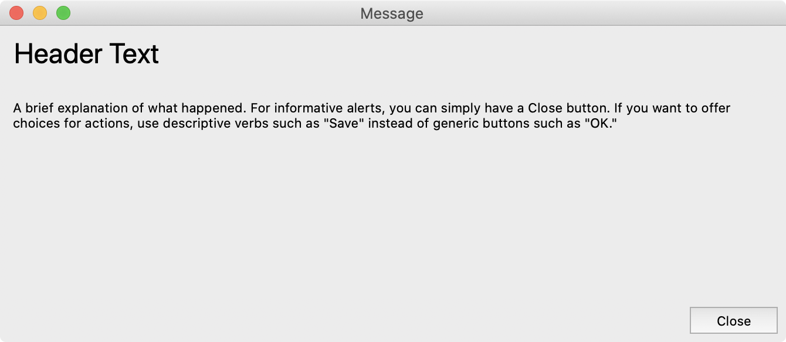

# resizable-labview-alert
Demo of a resizable, modal alert dialog in LabVIEW. Requires LabVIEW 2020 or later.

Splitter bars can be used to create a LabVIEW panel that resizes without any coding, but setting them up correctly can be challenging.

This project demonstrates the fundamentals:
- using Classic splitter bar styles in the window background color
- configuring splitter bar options (e.g. "stick right") to get the desired resize behavior
- locking splitter bars
- having controls resize to fit to their pane fluidly while the user resizes the window

When you open the main VI, the splitters are color-coded according to their resize behavior. 

When the VI runs, the code recolors the splitters to match the background color of the panel, making them invisible to the end user. 

When you resize the dialog, the header and description text fields fill the available space, and the button stays in the bottom-right corner.

When the dialog is closed, it changes the splitter colors back (according their resize behavior) before the VI stops running.

To change a splitter's resize behavior or lock state, right-click on the splitter.

